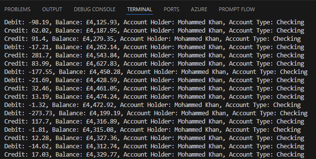

# Exercise: Improve Code Reliability Using GitHub Copilot Chat

## Overview
In this exercise, you will use GitHub Copilot Chat to generate suggestions that help improve code reliability in a sample application. The focus will be on enhancing exception handling, reducing unexpected issues, and improving unit test support.

## Prerequisites
Before starting this exercise, ensure you have the following tools and resources installed:
- Visual Studio Code
- The C# Dev Kit extension for Visual Studio Code
- GitHub Copilot and GitHub Copilot Chat extensions

## Steps

### 1. Prepare the Sample Application
1. Open the `APL2007M5BankAccount-Reliability` project in Visual Studio Code.
2. Familiarize yourself with the `Program.cs` and `BankAccount.cs` files under `BankAccountClass` project.
3. Build and run the project to ensure it works as expected:
   - Open the terminal in Visual Studio Code and run the following command:
   ```bash
   cd BankAccountClass
   dotnet run
   ```
   - The application should generate random bank account details and perform basic operations like crediting, debiting, and transferring funds.
   - The output should display the account details and the results of the operations. (Example output is below)
   - 

### 2. Identify Areas for Improvement
1. Review the following methods in the `BankAccount.cs` file:
   - `Credit`
   - `Debit`
   - `Transfer`
   - `CalculateInterest`
2. Consider aspects such as exception handling, potential issues, and reliability.

### 3. Use GitHub Copilot Chat to Generate Suggestions
1. Open the Chat view in `Ask` mode in Visual Studio Code.
2. Attach the `BankAccount.cs` file to the Chat context.
3. Use the following prompt to generate suggestions:
   - "`@workspace` How can I improve exception handling for the `Credit`, `Debit`, and `Transfer` methods?"

4. Review the suggestions provided by GitHub Copilot Chat.
5. Implement updates that enhance code reliability, such as:
   - Adding proper exception handling mechanisms.
   - Validating inputs to prevent unexpected issues.
12. Test the updated code to ensure no errors were introduced.
  13. Verify that the application behaves as expected.
    
### 6. Iterate and Refine
1. Open the Chat view in `Ask` mode in Visual Studio Code.
2. Attach the `BankAccount.cs` file to the Chat context.
3. Use the following prompt to generate suggestions:
   - "`@workspace` How can I improve unit test support for the `BankAccount` class?"
12. Test the updated code to ensure no errors were introduced.
13. Verify that the application behaves as expected.


### 6. Improve test support
1. Open the Chat view in `Ask` mode in Visual Studio Code.
2. Attach the `BankAccountTests.cs` file to the Chat context.
3. Use the following prompt to generate suggestions:
   - "`@workspace` How can I improve unit test support for the class?"
4. Implement updates that enhance test coverage, such as:
   - Adding test cases for edge scenarios.
   - Ensuring all methods are adequately tested.
5. Build and run the project to ensure no errors were introduced.
6. Run the unit tests to verify that all test cases pass.

### 6. Iterate and Refine
1. Use additional prompts to explore further improvements.
2. Repeat the process of reviewing, implementing, and testing updates.

   Consider the following additional prompts:
    - "`@workspace` How can I avoid future bugs or issues in the `Program.cs` file?"
    -  "`@workspace` How can I improve exception handling for the `Program.cs` file?"
    - "`@workspace` How can I improve performance with asynchronous tasks or methods in the `Program.cs` file?"

3. Implement updates that enhance code reliability, such as:
   - Refactoring methods to handle edge cases.
   - Improving exception handling and logging.
   - Managing asynchronous tasks effectively.


### Notes
- The suggestions provided by GitHub Copilot Chat are not exhaustive. Use your judgment and expertise to evaluate and implement them.
- Consider your workplace's coding standards and policies when choosing which updates to implement.
- Ensure thorough code reviews and testing to maintain high-quality code.

## Next Steps
After completing this exercise, explore the next modules to learn about improving code performance and security using GitHub Copilot Chat.