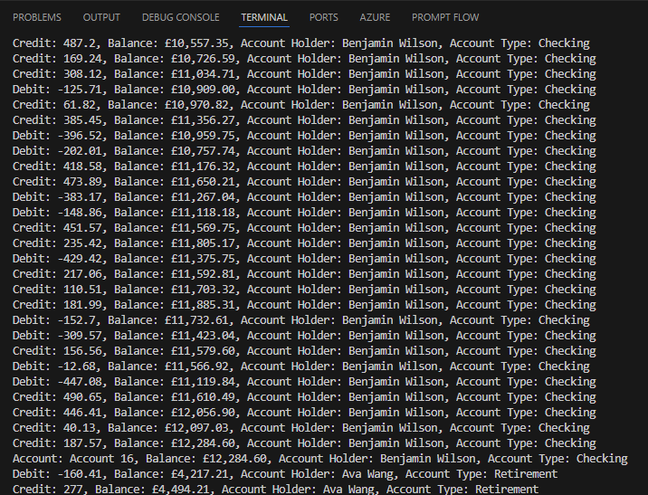

# Exercise: Improve Code Quality Using GitHub Copilot Chat

## Overview
In this exercise, you will use GitHub Copilot Chat to generate suggestions that help improve code quality in a sample application. The focus will be on enhancing readability, maintainability, and modularity of the codebase.

## Prerequisites
Before starting this exercise, ensure you have the following tools and resources installed:
- Visual Studio Code
- The C# Dev Kit extension for Visual Studio Code
- GitHub Copilot and GitHub Copilot Chat extensions

## Steps

### 1. Prepare the Sample Application
1. Open the `APL2007M5BankAccount` project in Visual Studio Code.
2. Familiarize yourself with the `Program.cs` and `BankAccount.cs` files.
3. Build and run the project to ensure it works as expected:
   - Open the terminal in Visual Studio Code and run the following command:
   ```bash
   cd BankAccountClass
   dotnet run
   ```
   - The application should generate random bank account details and perform basic operations like crediting, debiting, and transferring funds.
   - The output should display the account details and the results of the operations (example output is below).
   - 

### 2. Identify Areas for Improvement
1. Review the following methods in the `Program.cs` file:
   - `Main`
   - `GenerateRandomBalance`
   - `GenerateRandomAccountHolder`
   - `GenerateRandomAccountType`
   - `GenerateRandomDateOpened`
2. Consider aspects such as readability, maintainability, and modularity.

### 3. Use GitHub Copilot Chat to Generate Suggestions
1. Open the Chat view in `Ask` mode in Visual Studio Code.
2. Check that the the `Program.cs` file is attached to the Chat context, if it is not then ensure you have it selected in the editor.
3. Use the following prompt to generate suggestions:
   - "`@workspace` How can I improve the readability of the `GenerateRandomBalance`, `GenerateRandomAccountHolder`, `GenerateRandomAccountType`, and `GenerateRandomDateOpened` methods?"

4. Review the suggestions provided by GitHub Copilot Chat.
5. Implement updates that enhance code quality, such as:
   - Extracting repeated code into separate methods.
   - Improving naming conventions and code comments.


### 5. Test the Updated Code
1. Build and run the project to ensure no errors were introduced.
2. Verify that the application behaves as expected.


### 6. Iterate and Refine
   - Use additional prompts to explore further improvements.
   - Repeat the process of reviewing, implementing, and testing updates.
   
   Consider the following additional prompts:
  1. Open the Chat view in `Ask` mode in Visual Studio Code.
  2. Open the `Program.cs` file in the editor and select the code you want to improve (e.g.,  `Main`, `GenerateRandomBalance`, `GenerateRandomAccountHolder`, `GenerateRandomAccountType`, and `GenerateRandomDateOpened`).
  3. Use the following prompt to generate suggestions:
   - "`@workspace` How can I improve the maintainability of the methods?"
     - Note: add `#selection` to the prompt to limit the suggestions to the selected code.
  4. Review the suggestions provided by GitHub Copilot Chat.
 5. Implement updates that enhance code quality, such as:
      - Refactoring large methods into smaller, reusable methods.
      - Following the principle of Separation of Concerns.
  6. Test the updated code to ensure no errors were introduced.
  7. Verify that the application behaves as expected.

### 6. Iterate and Refine
  7. Open the Chat view in `Ask` mode in Visual Studio Code.
  8. Check that the the `Program.cs` file is attached to the Chat context, if it is not then ensure you have it selected in the editor.
  9.  Use the following prompt to generate suggestions:
   - "`@workspace` How can I improve the modularity of this file?"
  10. Review the suggestions provided by GitHub Copilot Chat.
  11. Implement updates that enhance code quality, such as:
      - Organizing code into smaller, reusable components.
      - Ensuring methods have a single responsibility.
  12. Test the updated code to ensure no errors were introduced. If you do see errors, ask GitHub copilot how to resolve them.
  13. Verify that the application behaves as expected.

## Notes
- The suggestions provided by GitHub Copilot Chat are not exhaustive. Use your judgment and expertise to evaluate and implement them.
- Consider your workplace's coding standards and policies when choosing which updates to implement.
- Ensure thorough code reviews and testing to maintain high-quality code.
- If GitHub Copilot suggests creating a new file, use the "insert into new file" option to have it create the file for you.

